# Architecture Documentation

## System Overview

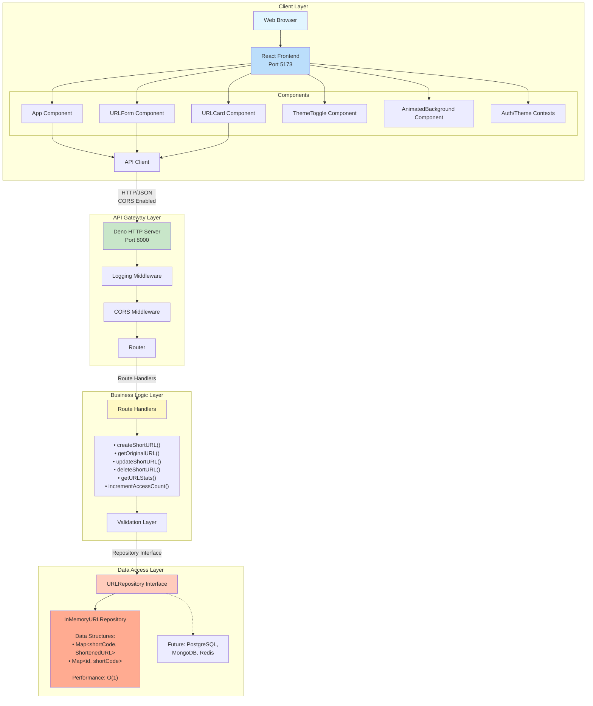

### Frontend Component Responsibilities

| Component | Responsibility | Key Interactions |
|-----------|----------------|------------------|
| `App.tsx` | Auth-gated shell coordinating hero, stats, and CRUD views | Consumes `AuthContext`, `ThemeContext`, orchestrates API calls |
| `ThemeToggle.tsx` | Floating command palette for light/dark toggle and accent palette selection | Consumes `ThemeContext`, triggers `toggleMode`/`setColorTheme` |
| `AnimatedBackground.tsx` | GPU-friendly gradient and motion backdrop reacting to theme changes | Reads active mode/palette from `ThemeContext` |
| `URLForm.tsx` | Controlled form for create/update flows | Emits callbacks to `App` after API success |
| `URLCard.tsx` | Displays short link details with copy/edit/delete interactions | Triggers parent callbacks, lazy-loads stats |
| `AuthContext.tsx` | Persists JWT tokens, exposes login/register/logout APIs | Wraps app, integrates with backend auth endpoints |
| `ThemeContext.tsx` | Persists theme preferences, maps palettes to DaisyUI themes | Wraps app, read by UI components |

## Request Flow

### Create Short URL

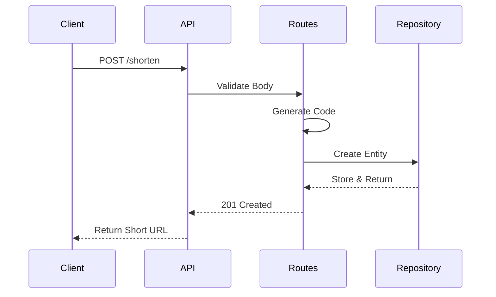

### Redirect Flow

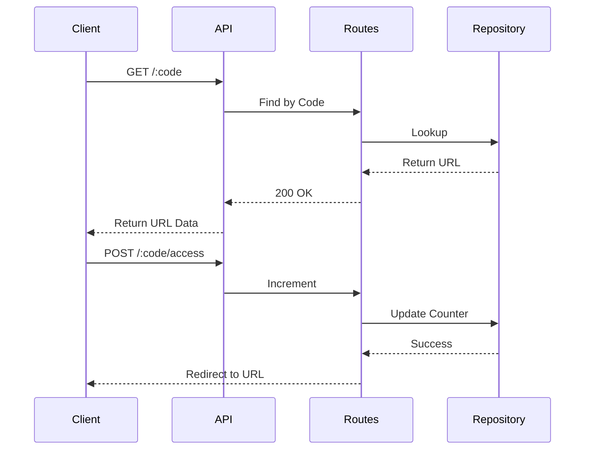

## Authentication Flow

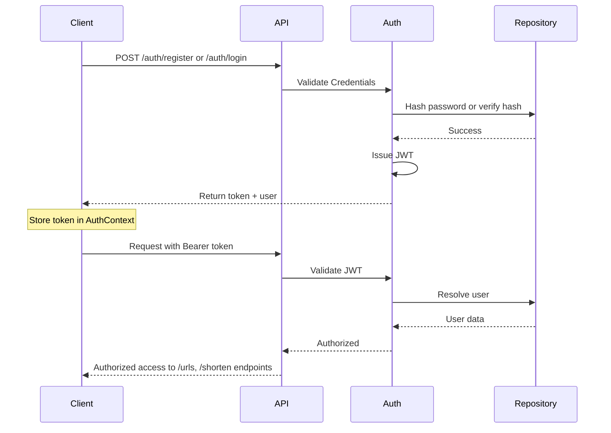

## Data Model

```typescript
interface ShortenedURL {
  id: string;           // UUID for internal reference
  url: string;          // Original long URL
  shortCode: string;    // Unique short code (Base62)
  createdAt: string;    // ISO 8601 timestamp
  updatedAt: string;    // ISO 8601 timestamp
  accessCount: number;  // Number of times accessed
    userId?: string;      // Owner of the URL (optional for legacy data)
}

interface PublicUser {
    id: string;           // UUID for the authenticated user
    email: string;        // Unique email address
    createdAt: string;    // ISO 8601 timestamp
    updatedAt: string;    // ISO 8601 timestamp
}

interface AuthResponse {
    token: string;        // JWT bearer token
    user: PublicUser;     // Authenticated user payload
}
```

## Design Patterns Used

### 1. Repository Pattern
**Purpose**: Separate data access logic from business logic

**Implementation**:
```typescript
interface URLRepository {
  create(url: ShortenedURL): Promise<ShortenedURL>;
  findByShortCode(shortCode: string): Promise<ShortenedURL | null>;
  // ... other methods
}
```

**Benefits**:
- Easy to swap implementations (in-memory → database)
- Testable (can mock repository)
- Single responsibility

### 2. Middleware Pattern
**Purpose**: Composable request processing

**Implementation**:
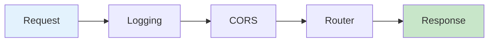

**Benefits**:
- Reusable middleware
- Clear separation of concerns
- Easy to add new middleware

### 3. Error Handling Pattern
**Purpose**: Consistent error responses

**Implementation**:
```typescript
class ValidationError extends Error { }
class NotFoundError extends Error { }

function handleError(error: unknown): Response {
  if (error instanceof ValidationError) return 400;
  if (error instanceof NotFoundError) return 404;
  return 500;
}
```

**Benefits**:
- Type-safe error handling
- Consistent error format
- No internal details leaked

### 4. DTO Pattern
**Purpose**: Separate API contracts from domain models

**Implementation**:
```typescript
interface CreateURLRequest { url: string; }
interface ShortenedURL { id, url, shortCode, ... }
```

**Benefits**:
- API versioning flexibility
- Validation at boundaries
- Client doesn't need all fields

### 5. Singleton Pattern
**Purpose**: Single instance of repository

**Implementation**:
```typescript
export const urlRepository: URLRepository = new InMemoryURLRepository();
```

**Benefits**:
- Single source of truth
- Consistent state
- Simple lifecycle

## Security Architecture

### Input Validation
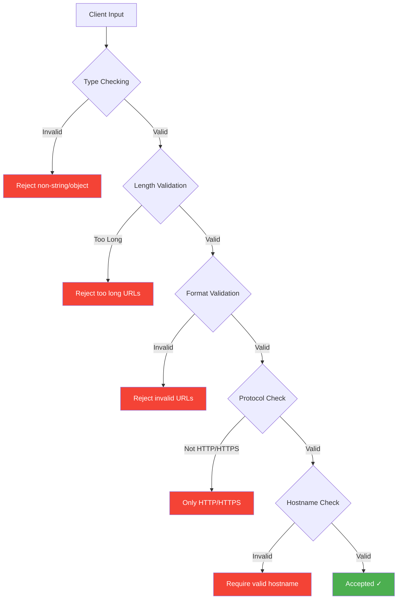

### CORS Protection
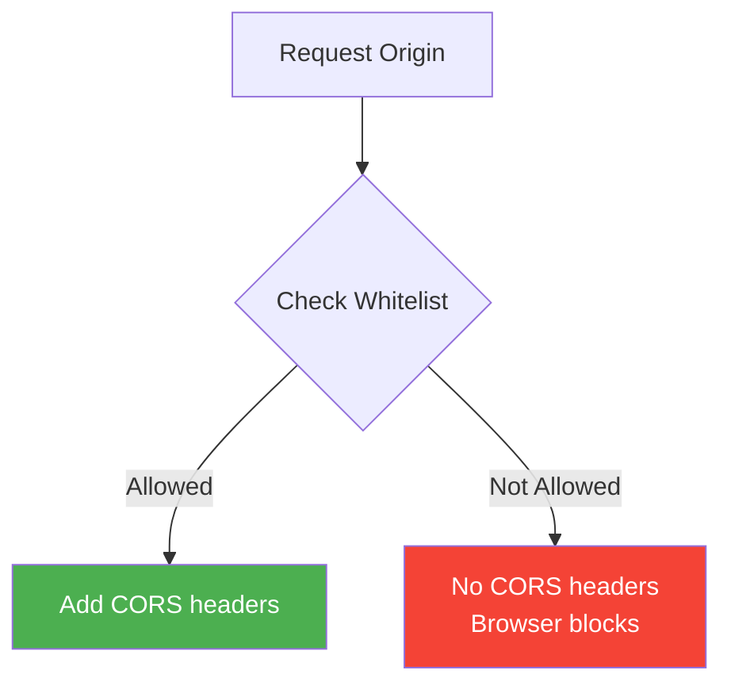

### Short Code Generation
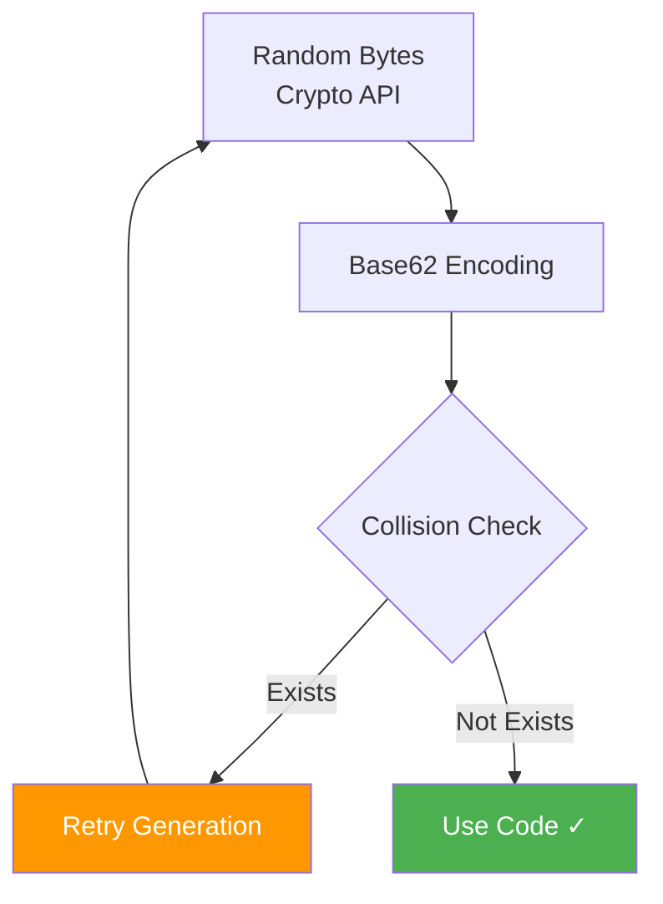

## Scalability Considerations

### Current (MVP)
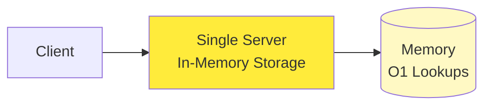

### Next Steps

#### 1. Database Layer
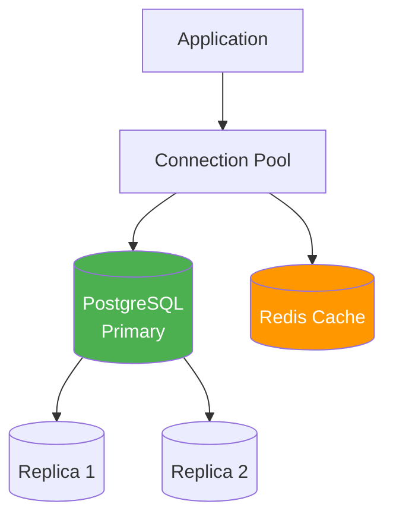

#### 2. Horizontal Scaling
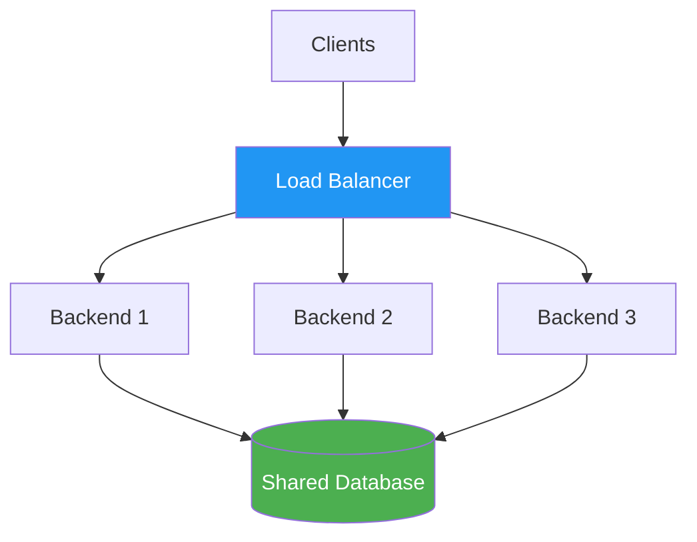

#### 3. Caching Strategy
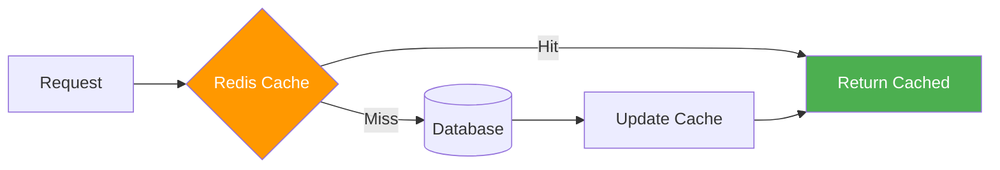

#### 4. Analytics Pipeline
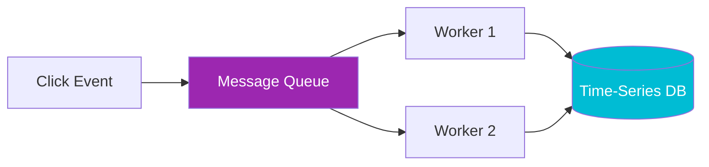

### Migration Path: In-Memory → PostgreSQL

```typescript
// 1. Keep same interface
class PostgresURLRepository implements URLRepository {
  // 2. Implement same methods with SQL
  async create(url: ShortenedURL): Promise<ShortenedURL> {
    const result = await db.query(
      'INSERT INTO urls (...) VALUES (...)',
      [...]
    );
    return result.rows[0];
  }
}

// 3. Swap implementation - no other code changes!
export const urlRepository: URLRepository = new PostgresURLRepository();
```

## Performance Characteristics

### Time Complexity
- Create: O(1) average, O(n) worst case (collision retry)
- Read: O(1)
- Update: O(1)
- Delete: O(1)
- Stats: O(1)

### Space Complexity
- Per URL: O(1)
- Total: O(n) where n = number of URLs

### Expected Load (MVP)
- Requests/second: 100
- URLs stored: 10,000
- Memory usage: ~10 MB

### Production Load (Estimated)
- Requests/second: 10,000+
- URLs stored: 100M+
- Memory usage: Database-backed
- Response time: <50ms p99

## Monitoring & Observability

### Metrics to Track
- Request rate
- Error rate
- Response time
- URL creation rate
- Popular URLs
- Storage usage

### Logging
- All requests (method, path, status, duration)
- All errors (with stack trace)
- Access counts
- Collision occurrences

### Health Checks
- GET /health endpoint
- Returns uptime and status
- Used by load balancers

## Deployment Architecture

### Development
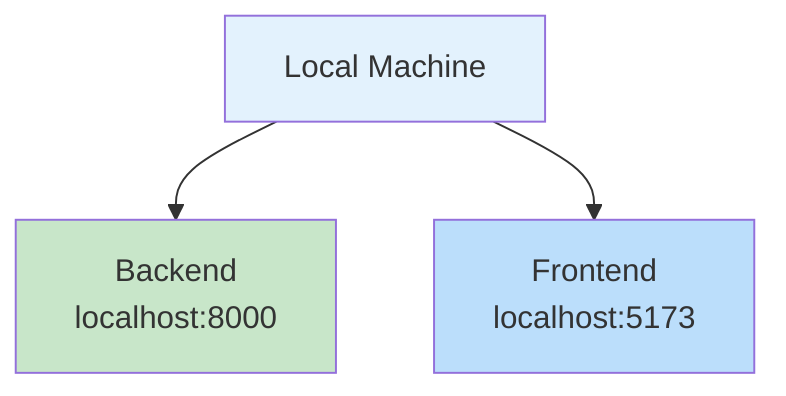

### Production
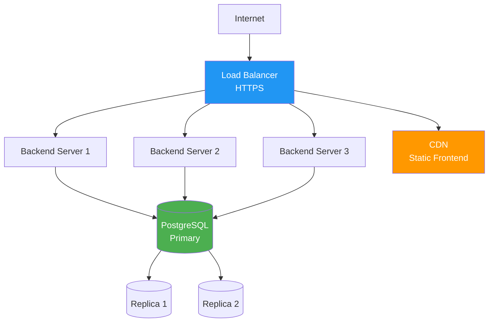

## Technology Stack Rationale

### Deno
**Why**: Modern runtime, built-in TypeScript, secure by default

### TypeScript
**Why**: Type safety, better IDE support, fewer runtime errors

### React
**Why**: Component-based, large ecosystem, proven at scale

### DaisyUI
**Why**: Pre-built components, consistent design, accessibility

### Vite
**Why**: Fast HMR, optimized builds, modern development experience

### Tailwind CSS
**Why**: Utility-first, no CSS conflicts, small production bundle
