# 🔗 URL Shortener

A modern URL shortening service with user accounts, custom categories, and analytics. Built with Deno, React, and PostgreSQL.

## 🌐 Live Demo

- **Frontend**: [url-shortner-self-mu.vercel.app](https://url-shortner-self-mu.vercel.app)
- **Backend API**: [url-shortner-1-pzxs.onrender.com](https://url-shortner-1-pzxs.onrender.com)
- **Health Check**: [url-shortner-1-pzxs.onrender.com/health](https://url-shortner-1-pzxs.onrender.com/health)

## ✨ What It Does

- 🔐 **User Accounts** - Sign up and manage your own URLs
- 📊 **Analytics** - See how many times your links get clicked
- 🏷️ **Categories** - Group your URLs however you want
- 🎨 **Clean Interface** - Dark mode support, works on mobile
- ⚡ **Actually Fast** - Deno backend + Neon PostgreSQL
- 🔒 **Security Built-in** - JWT auth, CORS, password hashing

## 🏗️ Architecture



```mermaid
graph TB
    subgraph "Frontend - Vercel"
        A[React + Vite]
        B[TailwindCSS]
        A --> B
    end

    subgraph "Backend - Render"
        C[Deno Server]
        D[JWT Auth]
        E[CORS Handler]
        C --> D
        C --> E
    end

    subgraph "Database - Neon"
        F[(PostgreSQL)]
        G[Users Table]
        H[URLs Table]
        I[Categories Table]
        F --> G
        F --> H
        F --> I
    end

    A -->|HTTPS| C
    C -->|SQL Queries| F

    style A fill:#61dafb
    style C fill:#000
    style F fill:#336791
```

**How it works:**
1. You visit the site and create an account
2. Frontend sends your request to the Deno backend on Render
3. Backend validates everything and saves to PostgreSQL on Neon
4. You get a short link like `url-shortner-1-pzxs.onrender.com/abc123`
5. Anyone who clicks that link gets redirected to your original URL
6. We count every click so you can see your stats

## 🚀 Running Locally

### What You Need

- [Deno](https://deno.land/) - The backend runtime
- [Node.js](https://nodejs.org/) - For frontend build tools
- [Neon account](https://neon.tech/) - Free PostgreSQL database

### Setup Steps

```bash
# Get the code
git clone https://github.com/Voodels/URL-Shortner.git
cd URL-Shortner

# Create your env file
cp .env.example .env
```

Now edit `.env` with your database info:

```env
PORT=8000
JWT_SECRET=your_secret_here  # openssl rand -base64 32
ALLOWED_ORIGINS=http://localhost:5173

DB_TYPE=postgres
DB_HOST=your-project.neon.tech  # from neon.tech dashboard
DB_PORT=5432
DB_USER=neondb_owner
DB_PASSWORD=your_password
DB_NAME=neondb
DB_TLS=true
```

Setup the database:
```bash
PGPASSWORD='your_password' psql \
  -h your-project.neon.tech \
  -U neondb_owner \
  -d neondb \
  -f database/schema_postgres.sql
```

Install frontend stuff:
```bash
cd frontend
npm install
cd ..
```

Start everything:
```bash
./dev.sh
```

Or manually:
```bash
# Terminal 1
cd backend
deno run --allow-net --allow-env --allow-read server.ts

# Terminal 2
cd frontend
npm run dev
```

Open http://localhost:5173 and you're good to go!

## 📁 Project Structure

```
.
├── backend/              # Deno backend API
│   ├── server.ts        # Main server entry point
│   ├── routes.ts        # API route handlers
│   ├── database.ts      # Database configuration
│   ├── postgres-store.ts # PostgreSQL repository
│   ├── auth-service.ts  # Authentication logic
│   └── types.ts         # TypeScript type definitions
│
├── frontend/            # React frontend
│   ├── src/
│   │   ├── App.tsx      # Main app component
│   │   ├── components/  # React components
│   │   └── api.ts       # API client
│   └── package.json
│
├── database/            # Database schemas
│   ├── schema_postgres.sql  # PostgreSQL schema
│   └── schema.sql           # Original MySQL schema
│
├── .env                 # Environment variables (not in git)
├── .env.example         # Environment template
├── dev.sh              # Development startup script
└── README.md           # This file
```

## 🔧 API Endpoints

### Authentication
- `POST /auth/register` - Register new user
- `POST /auth/login` - Login user
- `GET /me` - Get current user info

### URLs
- `POST /shorten` - Create short URL
- `GET /shorten/:shortCode` - Get URL details
- `PUT /shorten/:shortCode` - Update URL
- `DELETE /shorten/:shortCode` - Delete URL
- `GET /urls` - Get user's URLs
- `GET /shorten/:shortCode/stats` - Get URL statistics
- `GET /:shortCode` - Redirect to original URL

### Categories
- `GET /categories` - Get user's categories
- `POST /categories` - Create category
- `PUT /categories/:id` - Update category
- `DELETE /categories/:id` - Delete category
- `POST /shorten/:shortCode/categories` - Add categories to URL
- `DELETE /shorten/:shortCode/categories` - Remove categories from URL

## 🛠️ Built With

**Backend**
- Deno - Modern JavaScript/TypeScript runtime
- PostgreSQL - Database (hosted on Neon)
- JWT + bcrypt - Authentication

**Frontend**
- React 18 - UI framework
- Vite - Build tool (crazy fast)
- TailwindCSS + DaisyUI - Styling

**Hosting**
- Render - Backend deployment
- Vercel - Frontend deployment
- Neon - PostgreSQL database

## � Deploying Your Own

### Backend on Render

1. Fork this repo
2. Create account on [Render](https://render.com)
3. New Web Service → Connect your fork
4. Settings:
   - **Environment**: Docker
   - **Dockerfile Path**: `docker/Dockerfile.backend`
   - **Docker Context**: `./`
5. Add environment variables from your `.env`
6. Deploy!

Test it: `curl https://your-app.onrender.com/health`

### Frontend on Vercel

1. Create account on [Vercel](https://vercel.com)
2. Import your fork
3. Settings:
   - **Framework**: Vite
   - **Root Directory**: `frontend`
   - **Build Command**: `npm run build`
   - **Output Directory**: `dist`
4. Add env var: `VITE_API_URL=https://your-backend.onrender.com`
5. Deploy!

**Important:** Update `ALLOWED_ORIGINS` on Render to include your Vercel URL:
```
ALLOWED_ORIGINS=https://your-backend.onrender.com,https://your-frontend.vercel.app
```

## 📝 Environment Variables Reference

| Variable | Description | Example |
|----------|-------------|---------|
| `PORT` | Backend server port | `8000` |
| `JWT_SECRET` | Secret for JWT token signing | Generate with `openssl rand -base64 32` |
| `ALLOWED_ORIGINS` | CORS allowed origins (comma-separated) | `http://localhost:5173,https://yourdomain.com` |
| `LOG_REQUESTS` | Enable request logging | `true` or `false` |
| `DB_TYPE` | Database type | `postgres`, `mysql`, or `memory` |
| `DB_HOST` | Database hostname | `your-project.neon.tech` |
| `DB_PORT` | Database port | `5432` |
| `DB_USER` | Database username | `your_username` |
| `DB_PASSWORD` | Database password | `your_password` |
| `DB_NAME` | Database name | `neondb` |
| `DB_TLS` | Enable TLS connection | `true` (recommended for Neon) |

## � Security Stuff

- Generate a random `JWT_SECRET` (don't use the example!)
- Never commit `.env` files
- Always use HTTPS in production
- Set `ALLOWED_ORIGINS` to your actual domains only
- Database uses TLS encryption

## 🤝 Want to Contribute?

Found a bug? Have an idea? PRs are welcome!

1. Fork it
2. Create your branch (`git checkout -b cool-feature`)
3. Commit changes (`git commit -m 'Added something cool'`)
4. Push (`git push origin cool-feature`)
5. Open a Pull Request

## 📄 License

MIT License - do whatever you want with it

---

**Made by [@Voodels](https://github.com/Voodels)**

Questions? Open an issue or check out the [live demo](https://url-shortner-self-mu.vercel.app)!
