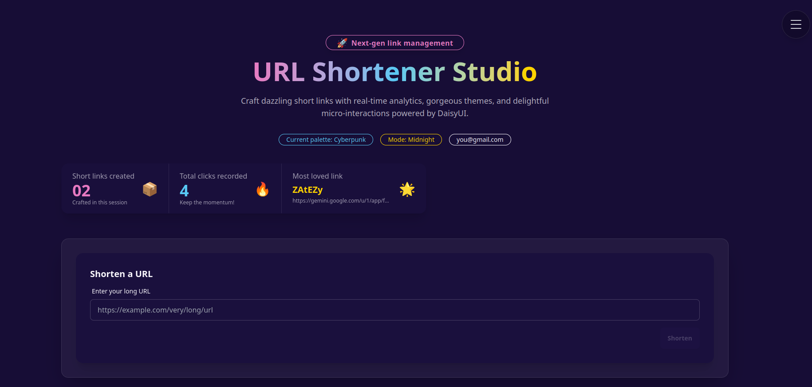
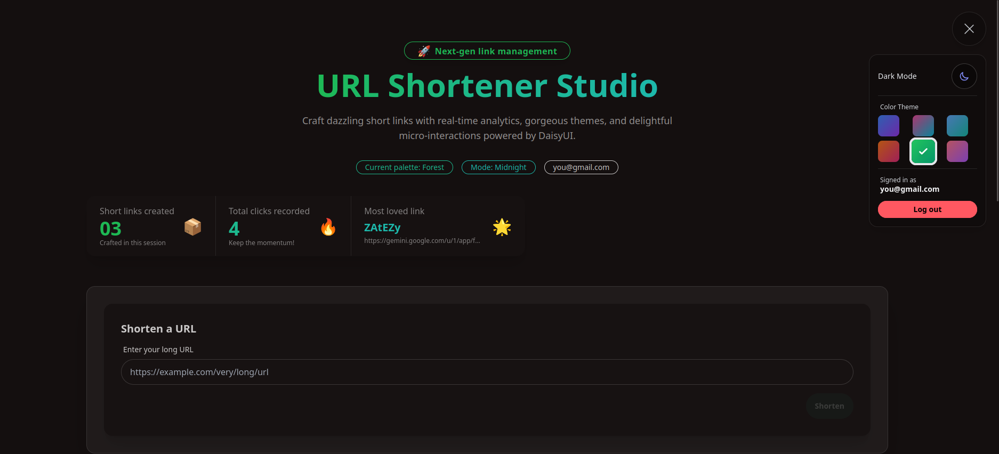
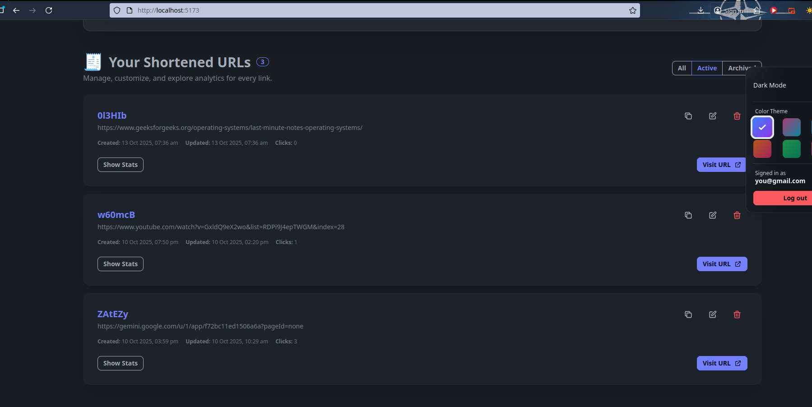

# URL Shortener

A URL shortening service built with Deno, TypeScript, React, and DaisyUI.

## Demo

### Login Page


### Dashboard


### URL Management


## Features

- User authentication (register/login)
- Create, update, and delete shortened URLs
- View analytics and access counts
- RESTful API with proper HTTP status codes
- Input validation and CORS support
- Responsive UI with theme switching
- Repository pattern for easy database swapping

## Architecture

The backend uses a repository pattern to abstract data access from business logic. This makes it easy to swap the in-memory store with a real database like PostgreSQL or MongoDB.

The frontend uses React with context providers for authentication and theming. Components follow a simple parent-child data flow pattern.

## API Endpoints

- `POST /shorten` - Create a shortened URL
- `GET /shorten/:code` - Get original URL by short code
- `PUT /shorten/:code` - Update a shortened URL
- `DELETE /shorten/:code` - Delete a shortened URL
- `GET /shorten/:code/stats` - Get access statistics
- `GET /health` - Health check endpoint

## Getting Started

### Prerequisites
- Deno 1.40 or higher

### Installation

```bash
git clone <repository-url>
cd URLSHORTNER
```

### Running the Application

Start both backend and frontend:
```bash
./start.sh
```

Or start them separately:

Backend (runs on http://localhost:8000):
```bash
deno task dev:backend
```

Frontend (runs on http://localhost:5173):
```bash
deno task dev:frontend
```

### Configuration

Optional `.env` file:
```env
PORT=8000
ALLOWED_ORIGINS=http://localhost:5173
LOG_REQUESTS=true
VITE_API_URL=http://localhost:8000
```

## Project Structure

```
URLSHORTNER/
├── backend/
│   ├── server.ts          # HTTP server and middleware
│   ├── routes.ts          # API route handlers
│   ├── store.ts           # In-memory repository
│   ├── mysql-store.ts     # MySQL repository implementation
│   └── types.ts           # TypeScript types
├── frontend/
│   ├── src/
│   │   ├── api.ts
│   │   ├── App.tsx
│   │   ├── AuthContext.tsx
│   │   ├── ThemeContext.tsx
│   │   └── components/
│   ├── vite.config.ts
│   └── tailwind.config.js
└── start.sh
```

## Tech Stack

- **Backend**: Deno, TypeScript
- **Frontend**: React, Vite, DaisyUI, Tailwind CSS
- **Database**: In-memory (with MySQL implementation available)

## License

MIT
