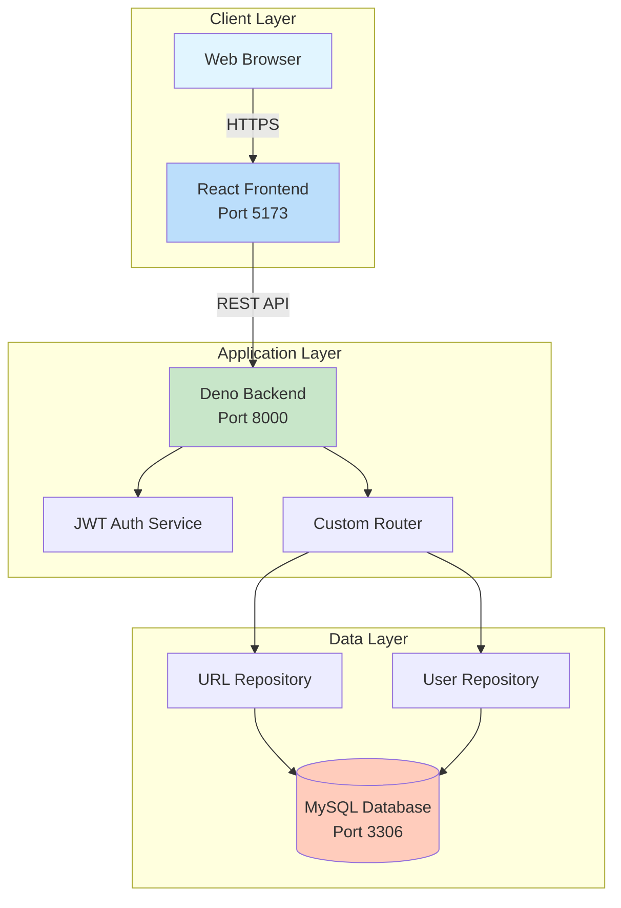
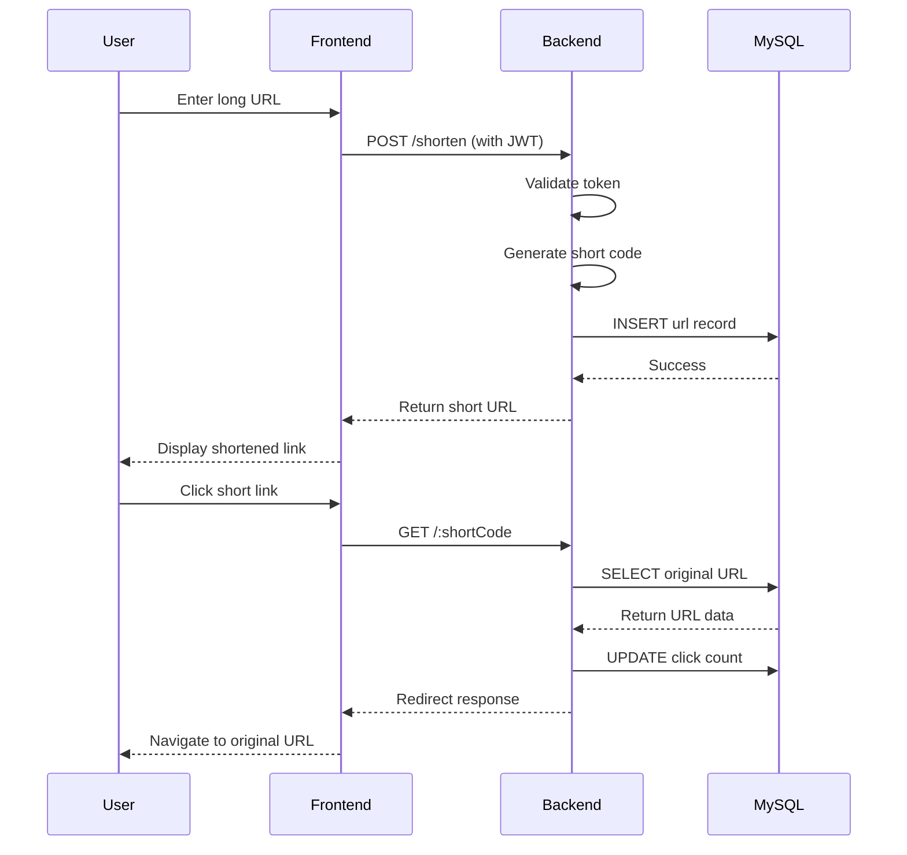
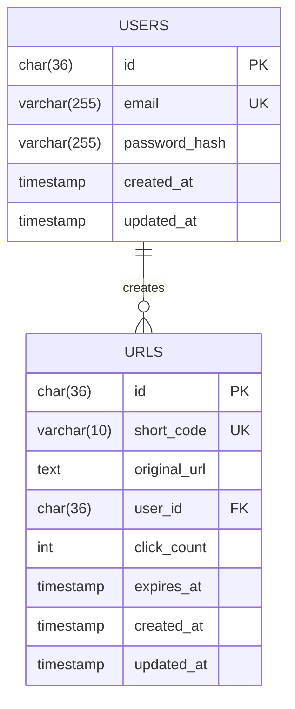
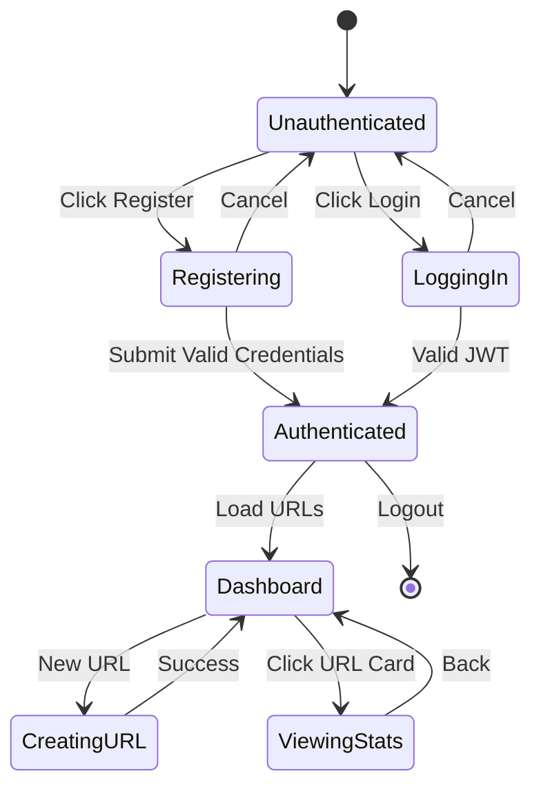
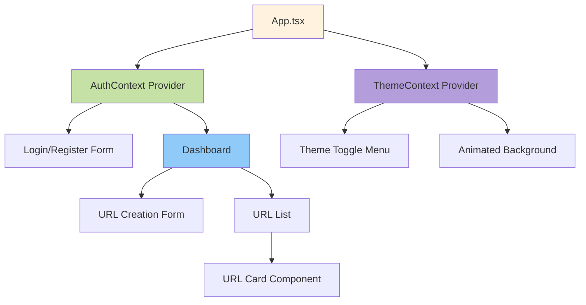
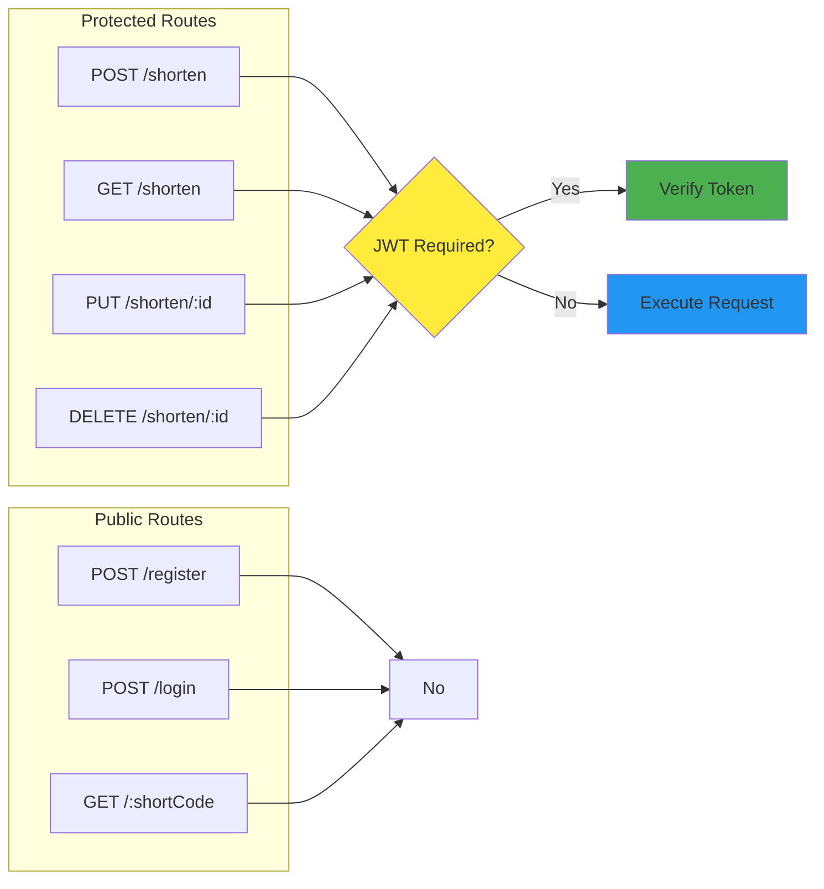

# 🔗 URL Shortener - Project Blog

## Problem Statement

As a student constantly sharing resources with classmates—study materials, project repositories, documentation links—I found myself dealing with unwieldy URLs that broke in messaging apps, looked unprofessional in presentations, and were impossible to remember. I needed a solution that was:
- **Fast**: Generate short links instantly
- **Secure**: Protect my links with user authentication
- **Persistent**: Store data reliably, not just in browser memory
- **Elegant**: Beautiful UI that works across devices

This project became my exploration into building a production-ready URL shortener from scratch.

---

## Tech Stack

I love exploring new technologies, and while I was comfortable with the MERN stack, I wanted to push beyond my comfort zone:

### Backend
- **Deno 2.1.4**: Modern JavaScript runtime with built-in TypeScript support, secure by default
- **TypeScript**: Type safety and better developer experience
- **MySQL 8.0**: Robust relational database for persistent storage
- **Docker**: Containerized database for easy setup and deployment

### Frontend
- **React 18.3** with TypeScript: Component-based UI architecture
- **Vite**: Lightning-fast build tool and dev server
- **TailwindCSS + DaisyUI**: Utility-first styling with pre-built components
- **JWT Authentication**: Secure user sessions

### Why No Oak?
Initially considered Oak (Deno's Express-like framework) but opted for a **custom router built with native Deno APIs** to:
- Minimize dependencies
- Learn low-level HTTP handling
- Keep the runtime lightweight
- Have full control over middleware

---

## High Level Design



### System Flow



---

## Demo

### Live Deployment
-- not yet


---

## Low Level Design

### Database Schema



### Authentication Flow



### Component Architecture



### API Endpoints



---

## Challenges Faced and Overcome

### 1. **First Time with Deno & TypeScript**
**Challenge**: Coming from Node.js, I struggled with:
- Deno's permission system (`--allow-net`, `--allow-env`)
- Import maps and module resolution
- TypeScript strict typing

**Solution**:
- Read Deno's official docs thoroughly
- Used `deno.json` for centralized config
- Enabled strict TypeScript checks incrementally

### 2. **MySQL Connection from Docker**
**Challenge**: Backend kept failing with "Access denied" errors. The issue was connecting from Deno (running on host) to MySQL (running in Docker).

**Error**:
```
Access denied for user 'urluser'@'172.22.0.1' (using password: YES)
```

**Solution**:
- Used `docker-compose.yml` to expose MySQL on `localhost:3306`
- Created `.env` file with proper credentials:
  ```env
  DB_HOST=localhost
  DB_USER=urluser
  DB_PASSWORD=urlpassword
  ```
- Added `--env-file=.env` flag to Deno startup

### 3. **CORS Issues Between Frontend & Backend**
**Challenge**: React dev server (port 5173) couldn't talk to Deno API (port 8000).

**Solution**:
- Built custom CORS middleware
- Handled `localhost` and `127.0.0.1` equivalently
- Added proper `Access-Control-Allow-Origin` headers

### 4. **DateTime Format Mismatch**
**Challenge**: MySQL rejected JavaScript ISO date strings:
```
Incorrect datetime value: '2025-10-10T09:25:56.168Z'
```

**Solution**:
- Created helper function to convert ISO strings to MySQL format:
  ```typescript
  function toMySQLDateTime(date: Date): string {
    return date.toISOString().slice(0, 19).replace('T', ' ');
  }
  ```

### 5. **Theme Switching Not Working**
**Challenge**: DaisyUI theme wasn't applying; gradient buttons didn't change appearance.

**Solution**:
- Properly mapped palette names to DaisyUI themes in `ThemeContext`
- Set `data-theme` attribute on root HTML element
- Used CSS transitions for smooth theme changes

### 6. **Data Loss After Page Refresh**
**Challenge**: URLs disappeared on refresh despite having MySQL.

**Solution**:
- Realized the app was still using in-memory store as fallback
- Fixed database initialization in `database.ts`
- Ensured `DB_TYPE=mysql` was set in `.env`

### 7. **Authentication State Management**
**Challenge**: JWT token wasn't persisting across page reloads.

**Solution**:
- Stored JWT in `localStorage`
- Created `AuthContext` to hydrate state on mount
- Added token expiry checks

---

## Key Learnings

1. **Deno's Security Model**: Love the explicit permissions—forces you to think about what your app really needs
2. **TypeScript Benefits**: Caught so many bugs at compile time that would've been runtime errors in plain JS
3. **Database Design**: Proper indexing (on `short_code`, `user_id`) makes queries blazingly fast
4. **Modern CSS**: TailwindCSS + DaisyUI = rapid UI development without fighting CSS
5. **Docker Compose**: Simplified local dev setup—one command to start everything

---

## Future Enhancements

- [ ] Custom short code selection (let users choose their own codes)
- [ ] QR code generation for each shortened URL
- [ ] Analytics dashboard with charts (clicks over time, geographic data)
- [ ] Bulk URL import via CSV
- [ ] API rate limiting to prevent abuse
- [ ] Link expiration reminders via email
- [ ] Social media preview customization (Open Graph tags)

---

## Conclusion

This project pushed me far beyond my MERN comfort zone. Working with Deno taught me modern JavaScript runtime capabilities, TypeScript enforced better code quality, and Docker simplified deployment complexity.

The biggest takeaway? **Read the error messages carefully**—90% of my issues were solved by actually understanding what the system was telling me, not blindly copying Stack Overflow answers.

If you're building something similar, start simple (in-memory store), then add complexity (database, auth) incrementally. Test each layer thoroughly before moving on.

---

## Resources

- **Code Repository**: [GitHub Link](https://github.com/Voodels/URL-Shortner)
- **Deno Docs**: https://docs.deno.com
- **MySQL Docs**: https://dev.mysql.com/doc/
- **TailwindCSS**: https://tailwindcss.com
- **DaisyUI**: https://daisyui.com

---

*Built with ❤️ by Vighnesh*
